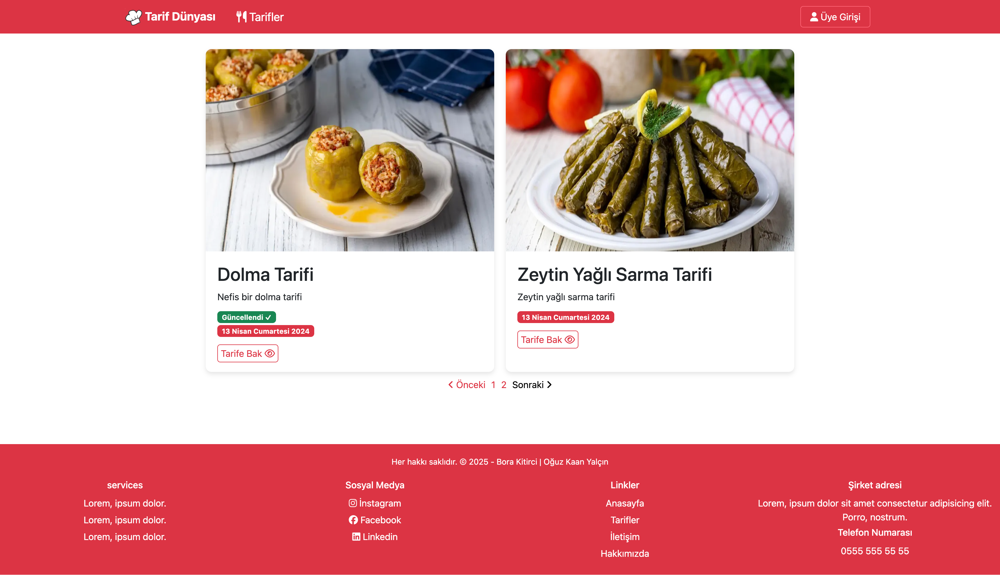
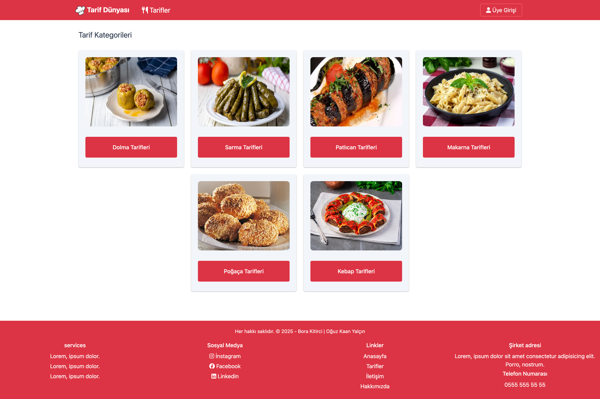
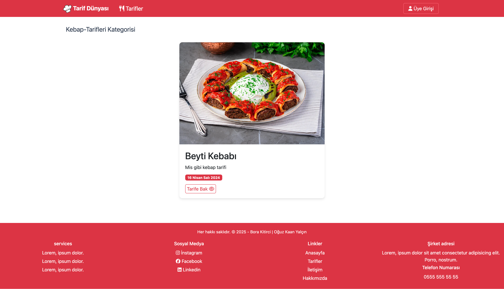

# 🍽️ Django ile Geliştirilmiş Yemek Tarifleri Uygulaması

Bu proje, kullanıcıların yemek tariflerini kategoriye göre listeleyip filtreleyebildiği, tarif detaylarını inceleyebildiği modern bir web uygulamasıdır. Ayrıca, yönetici kullanıcılar için tarif ve kategori yönetimi gibi işlemlerin yapılabildiği kapsamlı bir yönetim paneli sunulmaktadır.

Proje, Python tabanlı Django web çatısı kullanılarak geliştirilmiştir. Veritabanı olarak SQLite tercih edilmiştir. Arayüz tasarımı için Bootstrap kütüphanesi kullanılarak responsive (mobil uyumlu) ve kullanıcı dostu bir deneyim sağlanmıştır.

---

## Ana sayfa Görünümü

## Kategoriye Göre Ürün Listeleme Sayfası

## Ürün Filtreleme Sistemi

## Ürün İçerik Sayfası

## Yönetim Paneli Sayfası

---

## Geliştiriciler

- [Bora Kitirci](https://github.com/bboraki)
- [Oğuz Kaan Yalçın](https://github.com/oguzkaanyalcin)
